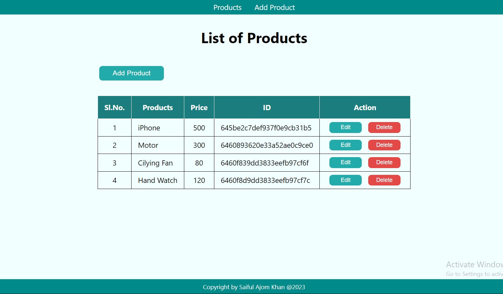

# Full Stack MERN CRUD Operations App
<!-- ### It's a Full Mobile Responsive App -->

### Go to Live Project: https://mern-stack-product-list-crud-app.netlify.app/
<!--  -->
<!--  -->

### Frontend & Backend uses libraries:
* React
* Node.js
* Express.js
* MongoDB
* Mongoose

##### It’s may be very simple CRUD operations which represent integrating Frontend with Backend.
##### It is very beginer frendly.

